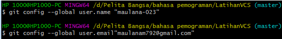

# LatihanVCS
Repository ini dibuat untuk memenuhi tugas Pertemuan 4 - Bahasa Pemrograman.

Nama    : Maulana Muhamad

NIM     : 312010188

Kelas   : TI.20. A.1

## Langkah-Langkah Penggunaan Git

* Download Git terlebih dahulu, dengan link berikut ini : [Click Here](https://git-scm.com/)

* Setelah file terdownload, silahkan lakukan instalasi dengan referensi berikut ini : [Git Installation Guide](https://git-scm.com/book/en/v2/Getting-Started-Installing-Git)

* Setelah installasi selesai, buka *software* **GitBash** pada menu di Windows, dan lakukan pengecekan versi, dengan mengetik syntax berikut :
    > git --version

* Jika muncul tampilan git version, berarti Git sudah berhasil di install dan bisa digunakan. Langkah pertama kita harus mengkonfigurasi user nama dan email di Git, dengan mengetikkan *syntax* berikut :
    > git config --global user.name "Masukkan Nama Anda disini"<rb>
    > git config --global user.email "Masukkan Email Anda disini"<rb>

    

* Setelah diisi, silahkan lakukan pengecekan user nama dan email, dengan mengetikkan perintah berikut :<rb>
    > git config --global user.name<rb>
    > git config --global user.email<rb>
* Buat akun di [GitHub](https://github.com) , seperti contoh dibawah ini. Dan lakukan *verifikasi* akun melalui email yang sudah terdaftar. 

* Jika akun GitHub sudah selesai dibuat dan diverifikasi, Proses selanjutnya silahkan buat *Repository* 
**Penjelasan** :  
    > * Repository Name : (Silahkan isi nama repository yang diinginkan, seperti contoh saya ingin membuat repository *LatihanVCS*)
    > * Description : (Isi dengan deskripsi atau penjelasan tentang repository Anda)
    > * Public / Private : (PIlih salah satu jenis repository akan bisa dilihan sama semua orang atau tidak)
    > * Add a README.md file : Centang pada bagian ini jika Anda menginginkan file README.md ada di repository Anda
    > * Add .gitignore : Merupakan  sebuah file yang berisi daftar nama-nama file dan direktori yang akan diabaikan oleh Git.
    > * Choose a license : Silahkan centang jika Anda memiliki lisensi pada repository yang akan dibuat. 
Kemudian tekan tombol **Create Repository** untuk menyimpan.

* Jika repository sudah dibuat maka akan muncul : 

* Pembuatan akun dan repository pada Github telah selesai, saat ini akan kita lakukan untuk *me-remote* repository Github pada GitBash Lokal. Bagaimana caranya?
Langkah pertama kita harus menyalin *link URL* git kita di Github, dengan cara tekan tombol **Code** lalu klik *Copy*.

* Setelah *Link URL* git kita ter*copy*, Silahkan buka File Explorer pada Windows, kemudian pilih folder dimana kita akan men*download* Repository dari Github ke lokal. Kemudian Klik Kanan, Pilih ***Git Bash Here***.

* *Pop Up* Command Prompt (CMD) akan terbuka. Pada proses ini kita akan melakukan download file repository yang tadi dibuat, dengan mengetikkan *syntax* berikut :
    > git clone [URL]
Pada contohnya, saya akan memasukkan *git clone https://github.com/maulana-023/LatihanVCS.git*

* Setelah proses cloning selesai, pada saat ini kita masih pada folder awal (master), kita harus masuk kedalam folder yang telah dicloning tadi yaitu *LatihanVCS* dengan mengetikkan *syntax* berikut :
    > cd LatihanVCS/

* Saat ini kita sudah masuk kedalam folder *LatihanVCS*, Silahkan edit file **README.md** yang ada di File Explorer. Bisa menggunakan Text Editor (*Sublime Text, Notepad, Notepad++, Visual Studio Code*). Edit sesuai dengan keinginan. Aturan file .md (Markdown) bisa dilihat di Link berikut ini : [Click Here](https://guides.github.com/features/mastering-markdown/)

Setelah file README.md diedit, silahkan Simpan file tersebut dengan cara **CTRL+S** atau **File -> Save**

* Langkah selanjutnya setelah file disimpan, kita kembali pada App Git Bash (CMD). Ketik pada Git Bash seperti berikut ini :
    > git add .

* Setelah selesai melakukan *git add .* langkah berikutnya kita akan melakukan **commit*. Fungsi commit adalah untuk menyimpan perubahan yang dilakukan, tetapi tidak ada perubahan pada remote repository. Ketik pada App Git Bash seperti berikut ini :
    > git commit "Update README.md"

* Git *commit* telah selesai di lakukan. Untuk saat ini akan melakuka Git Push, *Git Push* berfungsi untuk mengirimkan perubahan file setelah di commit ke remote repository. Silahkan ketik pada App Git Bash seperti berikut :
    > git push

* Semua proses telah selesai, silahkan kembali ke Web Browser untuk melihat perubahan yang telah di *commit* dan *push* dari remote. 

Hal yang diatas adalah cara mendownload git dan langkah-langkah menggunakan git
Sekian hanya ini yang dapat saya sampeikan, semoga kalian dapat memahaminya

##TERIMAKASIH
